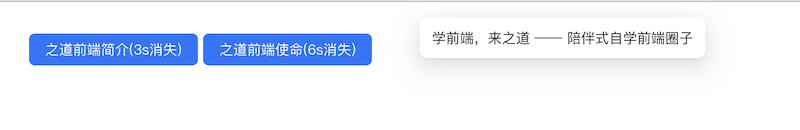

# `[P9-s1]` Message 全局提示组件-基础版

## 项目阶段简介

### 项目阶段介绍

按照设计稿和组件说明，实现基础版的 Message 全局提示组件。

基础版的 Message 全局提示组件只需要能正确弹出全局提示信息即可。

### 组件说明

- 可以显示全局提示的文本
- 可以自定义显示时间，默认 3s

### 设计稿说明

- 页面中有 2 个按钮，从左往右分别是：
  - 【之道前端简介(3s消失)】按钮：点击之后，页面顶部弹出提示弹窗，内容为：学前端，来之道 —— 陪伴式自学前端圈子。3 秒之后，提示弹窗消失。
  - 【之道前端使命(6s消失)】按钮：点击之后，页面顶部弹出提示弹窗，内容为：提升前端开发的职业天花板，延长前端开发的职业寿命。6 秒之后，提示弹窗消失。

> [在线体验](https://zhidaofe.github.io/P9-message-component/s1/index.html)

### 项目要求

- 先按照设计稿和组件说明，实现组件代码。然后在页面中使用你实现的组件来达到题目要求
- 保证最终实现的页面完全复现设计稿，真实的工作中，火眼金睛的设计师 1 px 的差异都能找到，不要心存侥幸
- **先按照设计稿和组件说明真得去开发，不要看参考答案！**，也不要去看业界和开源的组件库代码
- 如果开发过程中碰到问题，不知道怎么实现的话，去网上查找答案，不要去看答案！在真实的工作中，你不会有参考答案的，你只能自己想办法找到问题的解决方案
- 记录你的疑问，比如：
  - 有个很难实现的地方，总感觉自己实现的方案不是最优方案，还有更好的方案
  - 不知道自己的实现方案到底好不好
  - 完成开发之后，再整体 review 一遍自己的代码，觉得还有哪些地方是不够好的
- 带着你的疑问，再去查看参考答案或者开源组件库去寻找答案，如果还是没有得到解答，请来 [**之道前端**](https://kcnrozgf41zs.feishu.cn/wiki/PBj0w5rjUiEWVgktZE0caKOunNc) 提问

### 练习本项目你会收获什么？

- 提升原生 JavaScript 的编码熟练度
- 学会正确使用原生 JavaScript 处理 Dom
- 学会如何封装一个组件
- 【进阶】深刻理解什么是好的组件
- 【进阶】积累封装组件的经验
- 【进阶】逐渐形成自己的 JavaScript 代码风格

> 如果只实践一次，那就只会有基础收获
>
> 只有不断练习、思考、优化，才会有进阶收获

### 本项目适合的同学

- 处于 L2 水平的同学
- 对原生 JavaScript 还不熟练的同学
- 没怎么封装过 UI 组件的同学
- 没怎么写过 C 端页面，大部分时间在做 admin 系统的同学
- 只会开发 React/Vue 组件，想要练习如何封装原生 JavaScript 组件的同学

## 开始练习

我们针对不同经验的同学提供了相应的[练习指引手册](https://kcnrozgf41zs.feishu.cn/wiki/An7GwvUQrirdvdkJdQ9c4q3Rndd)，你可以按照这个指引手册来练习本项目。

