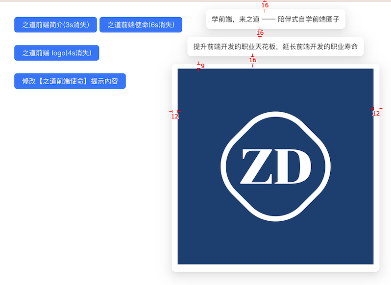

# `[P9-s4]` Message 全局提示组件-Vue版

## 项目阶段简介

### 项目阶段介绍

按照设计稿和组件说明，使用 Vue 重新实现 Message 组件，保持与原生 JavaScript 版本相同的功能和外观。

### 组件说明

- 实现与 s2 完全相同的功能
  - 可以显示多条全局提示的文本
  - 可以自定义显示时间，默认 3s
  - 可以修改某条全局提示
  - 可以通过自定义函数定制全局提示的内容

- 使用 Vue 组件的方式重新实现
- 保持与原生版本相同的外观和交互体验

### 设计稿说明

- 设计稿与 [s2 的设计稿](../s2/README.md) 完全相同
- 需要实现与 s2 完全一致的外观和交互效果

### 项目要求

- 使用 Vue 重新实现 s2 的所有功能
- 先按照设计稿和组件说明，实现组件代码。然后在页面中使用你实现的组件来达到题目要求
- 保证最终实现的页面完全复现设计稿，真实的工作中，火眼金睛的设计师 1 px 的差异都能找到，不要心存侥幸
- **先按照设计稿和组件说明真得去开发，不要看参考答案！**，也不要去看业界和开源的组件库代码
- 如果开发过程中碰到问题，不知道怎么实现的话，去网上查找答案，不要去看答案！在真实的工作中，你不会有参考答案的，你只能自己想办法找到问题的解决方案
- 记录你的疑问，比如：
  - 有个很难实现的地方，总感觉自己实现的方案不是最优方案，还有更好的方案
  - 不知道自己的实现方案到底好不好
  - 完成开发之后，再整体 review 一遍自己的代码，觉得还有哪些地方是不够好的
- 带着你的疑问，再去查看参考答案或者开源组件库去寻找答案，如果还是没有得到解答，请来 [**之道前端**](https://kcnrozgf41zs.feishu.cn/wiki/PBj0w5rjUiEWVgktZE0caKOunNc) 提问

### 练习本项目你会收获什么？

- 深入理解 Vue 组件的开发方式
- 学会如何将原生 JavaScript 组件迁移到 Vue
- 理解声明式编程与命令式编程的区别
- 学会如何在 Vue 中管理全局 Dom
- 学会如何封装一个 Vue 组件
- 【进阶】理解不同框架下组件开发的异同
- 【进阶】积累组件迁移重构的经验
- 【进阶】逐渐形成自己的 Vue 代码风格

> 如果只是完成功能转换，那就只会有基础收获
>
> 只有深入思考两种实现方式的优劣，才会有进阶收获

### 本项目适合的同学

- 处于 L3 水平的同学
- 想要提升 Vue 组件开发能力的同学
- 没怎么封装过 Vue UI 组件的同学
- 没怎么写过 C 端页面，大部分时间在做 admin 系统的同学

## 开始练习

我们针对不同经验的同学提供了相应的[练习指引手册](https://kcnrozgf41zs.feishu.cn/wiki/An7GwvUQrirdvdkJdQ9c4q3Rndd)，你可以按照这个指引手册来练习本项目。

